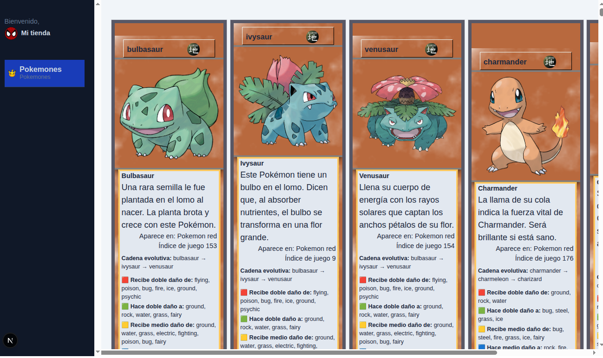

# 🧩 Pokémon Cards App

Este proyecto es una aplicación web construida con **Next.js** que muestra una lista de cartas de Pokémon consumiendo datos en tiempo real desde la [PokéAPI](https://pokeapi.co/api/v2/pokemon/).

## ✨ Características

- Listado dinámico de Pokémon.
- Datos obtenidos desde la PokéAPI.
- Diseño responsivo y limpio.

## 🔗 API Utilizada

Este proyecto utiliza la [PokéAPI](https://pokeapi.co/api/v2/pokemon/) para obtener la información de los Pokémon, incluyendo:

- Nombre
- Imágenes
- Tipos
- Información adicional de cada pokemon

## 🚀 Tecnologías

- [Next.js](https://nextjs.org/)
- [React](https://reactjs.org/)
- Tailwind 

## 📷 Capturas

Vista de la lista de cartas de Pokémon:



## 📦 Instalación

1. Clona el repositorio:

```bash
git clone https://github.com/tu-usuario/pokemon-cards-nextjs.git
cd pokemon-cards-nextjs

```
2. Instala dependencias:
```bash
npm install
```
3. Ejecutal el servidor de desarrollo:
```bash
npm run dev
```
4. Abre http://localhost:3000 en tu navegador para ver la app.

## 📝 Licencia
Este proyecto es de código abierto y se puede utilizar libremente con fines educativos o personales.

¡Disfruta atrapándolos todos! 🔥🐉⚡🌊
